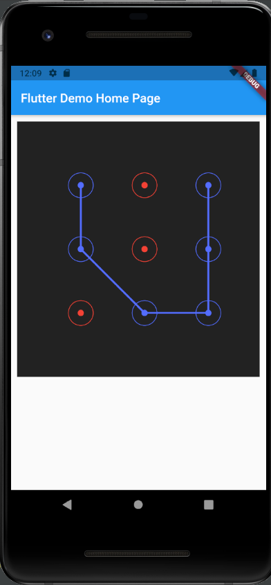

# Graphic Key Flutter widget

Allows users to draw graphic key to enter the secured area of the app.



## Install
Depend on it
Run this command:

*With Dart:*
```bash
dart pub add graphic_key
```

*With Flutter:*
```bash
flutter pub add graphic_key
```

This will add a line like this to your package's pubspec.yaml (and run an implicit dart pub get):
```yaml
dependencies:
  graphic_key: ^0.0.1
```
A
lternatively, your editor might support dart pub get or flutter pub get. Check the docs for your editor to learn more.

## Using
### Import it
```dart
import 'package:graphic_key/graphic_key.dart';
```

### Use it
```dart
GraphicKey(
      pointColor: Colors.red,
      pointStrokeWidth: 10,

      selectedPointColor: Colors.indigoAccent,
      selectedPointStrokeWidth: 10,

      pointCircleColor: Colors.red,
      pointCircleRadius: 20,
      pointCircleStrokeWidth: 1,

      selectedPointCircleColor: Colors.indigoAccent,
      selectedPointCircleRadius: 20,
      selectedPointCircleStrokeWidth: 1,

      lineColor: Colors.indigoAccent,
      lineStrokeWidth: 3,

      backgroundColor: Colors.black87,

      keyEnteredCallback: (List<int> numbers) {
        print(numbers);
      },
      pointSelectedCallback: (int pointNum) {
        print(pointNum);
      },
    );
```
